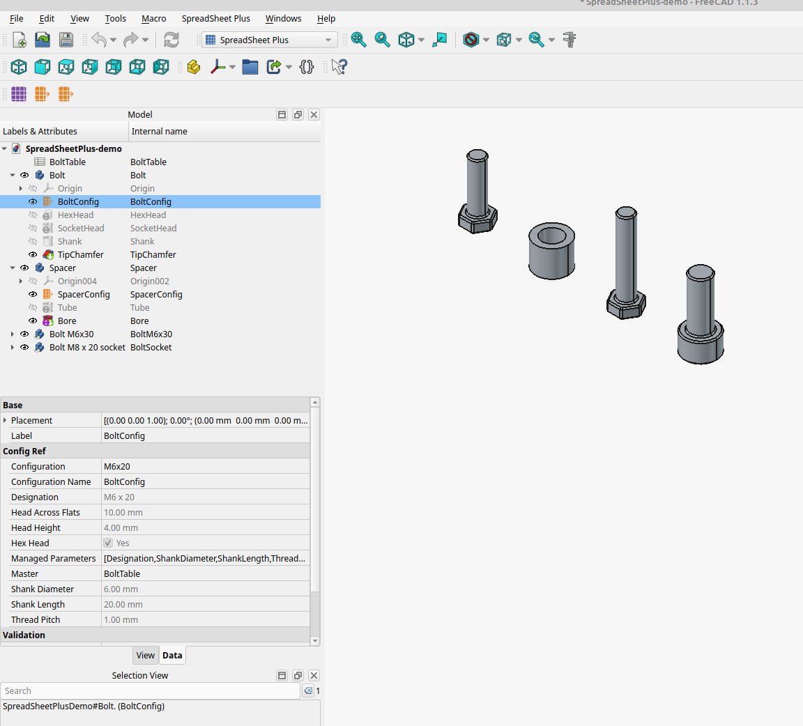

# SpreadSheetPlus examples

## The bolt family demo

One configuration table, two parts reading it and two variants. The document is
**generated rather than committed**, so build it once and then open it in FreeCAD
(1.0 or newer) with the addon installed:

```bash
freecadcmd -M <repo-root> examples/build_demo.py    # headless
freecad    -M <repo-root> examples/build_demo.py    # with the GUI
```

Either command writes `SpreadSheetPlus-demo.FCStd` next to this file (the GUI run
also saves a framed 3D view and keeps the variant bodies hidden). `build_demo.py`
is worth reading on its own: it is about hundred lines, and every step is one API
call (`MasterSheet.create`, `master.add_parameter`, `config_ref.create`,
`setExpression`, …).

| Object | What it shows |
| :--- | :--- |
| `BoltTable` | The master configuration table: 5 configurations (rows) × 7 parameters (columns), edited in FreeCAD's own spreadsheet editor. |
| `Bolt` (+ `BoltConfig`) | A PartDesign part - a chamfered shank with a hex or socket head - driven by one row of the table. |
| `Spacer` (+ `SpacerConfig`) | A second part, the same table, its own row: nothing is copied. |
| `BoltM6x30`, `BoltSocket` | Two variants of `Bolt`, each with its own row. |

The parts are laid out along the X axis (0, 30, 60, 90 mm) so the 3D view shows
them side by side.

## The tour

1. **The table is a plain spreadsheet.** Double-click `BoltTable` to open
   FreeCAD's spreadsheet editor: row 2 holds the parameter names
   (`ShankDiameter`, `ShankLength`, …), column A the configuration names
   (`M6x20`, `M6x30`, `M8x20`, `M8x40`, `M8x20s`). It is the single place the
   numbers live.

2. **A part links to the table instead of holding a copy.** Select `BoltConfig`
   (inside `Bolt`) and look at the property editor: `Master` is the sheet,
   `Configuration` the selected row, and the parameters below are **read-only
   mirrors** of that row. Their types were inferred from the cells -
   `ShankDiameter` is a `Length` (6.0 mm) because the cell says `6 mm`,
   `HexHead` is a checkbox because the cell says `True`, `Designation` is text.

3. **Switching the row rebuilds the part.** With `BoltConfig` selected run
   *Switch configuration* (or click the edit button on the `Configuration`
   field) and pick `M8x40`: the bolt grows. `M8x20s` is the socket-head row - the
   head becomes a cylinder instead of the hexagonal prism, because the table's
   `HexHead` column drives which of the two head features is suppressed.

4. **Edit the table and every part follows.** Change `BoltTable` cell `D3`
   (the `ShankLength` of `M6x20`) from `20 mm` to `40 mm`: `Bolt` is rebuilt as
   soon as the sheet recomputes. No per-part editing, no copy to keep in sync -
   that is the point of the workbench.

5. **Two parts, one table.** `Spacer` reads the *same* table with its *own* row
   (`M8x20`); it is cut by a subtractive cylinder on the same parameters. Add a
   row, add a part: the table stays the one place to edit.

6. **Variants.** `BoltM6x30` and `BoltSocket` are `App::Link`s to `Bolt` with
   *Link Copy On Change* enabled. Each was given its own row **on the link**,
   which is what makes FreeCAD copy the part for that variant; the template
   `Bolt` kept `M6x20`. The copied bodies (`Bolt001`, `Bolt002`, labelled "…
   (copy)") are the variants' own bodies, created by FreeCAD when the row was set
   on the link. Regenerate the file from the GUI to get them saved hidden.

7. **Things to try**
   - Add a parameter to the table (a new column header): it appears as a new
     property on every reference, and every part can use it in an expression.
   - Break the table on purpose - rename a parameter to something with a space,
     or give two configurations the same name: the references show a warning icon
     in the tree, `TableValid` turns `False` and `TableErrors` names the problem.
   - Select the `ConfigRef` that belongs to a **variant** (it is listed under the
     link, named `BoltConfig001`/`BoltConfig002`) and switch *its* row: only that
     variant changes, the template keeps its own.

## The fine print

What variants are built on - FreeCAD's `App::Link` copy-on-change:

- **The table stays shared.** FreeCAD copies the linked part *and the objects it
depends on*, which would include the master sheet; SpreadSheetPlus marks every
master sheet as shared (`master_sheet.keep_shared()`), so it is left out of that
copy and the variant's `ConfigRef` keeps reading `BoltTable` - all four parts
above, variants included, follow the same table and only their *row* is their own.
- **A variant's row is set on the link, never on the part.** Changing the row on
the part (the part's own drop-down, or a `ConfigRef` inside it) updates the
part - and every variant that still follows it - and creates nothing. FreeCAD
copies the part only when one of the *link's* mirrored properties changes.

See [docs/usage.md](../docs/usage.md) for the full guide and
[docs/api.md](../docs/api.md) for the API the example uses.


